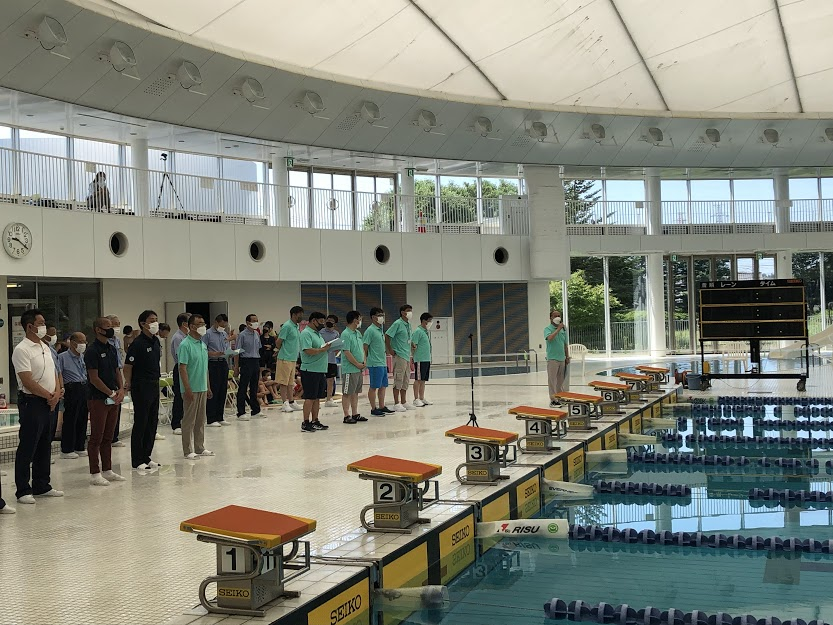
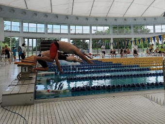
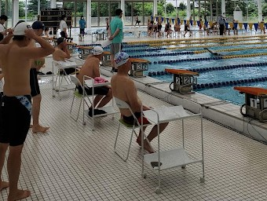

# suirenHP
<html lang="ja" data-loaded="false" data-scrolled="false" data-spmenu="closed">
<head>

<meta charset="UTF-8">
<meta http-equiv="Content-Type" content="text/html; charset=UTF-8">
<meta http-equiv="X-UA-Compatible" content="IE=edge">

<meta name="viewport" content="width=device-width, initial-scale=1.0">

<!--ここから上はお決まりの定型文です-->

<!--ここからが表現の書式などを決めるcssという部分-->

<!--
<link href="https://cdnjs.cloudflare.com/ajax/libs/lightbox2/2.7.1/css/lightbox.css" rel="stylesheet">
-->
</head>

<body>

<video id="bg-video" autoplay muted loop playsinline>
    <source src="https://torokoid.github.io/usurer_temp/background.mp4" type="video/mp4">
</video>

モバイル端末をお使いの場合は、画面を横向きにすると
背景画像の横方向がご覧頂けます。

<!--ここ上は、ほぼそのまま使います！-->

<!--QRコードの挿入例-->

 QR for Access
<!--

<marquee direction="left" scrollamount="20" width="30%">宇都宮市水泳連盟</marquee>

-->

<!--流れ文字の挿入例-->
<!--
<h1><marquee behavior="left">!!! GitHubで立ち上げる宇都宮市水泳連盟HPの叩き台です !!!</marquee></h1>
-->

<!--ヘッダー-->

  

  <h1 class="auto-style1">宇都宮市水泳連盟</h1>

<!--メインビジュアル-->

  
  
  	  <table style="width: 100%">
		  <tr>
			  <td></td>
			  <td></td>
			  <td></td>
		  </tr>
	  </table>  
  	

<!--メインビジュアル終了-->
<!--コンテンツ-->

  <!--メイン-->
  

    

      

      <u>このホームページでは、本連盟での活動について情報発信を目的として公開しています。</u>
      

    

 

     
    

      <h2>お知らせNews &amp; Tpoics</h2>
      <dl class="auto-style">        
      
		<h2><dt>2026.08.25</dt>
        <dd><a>年間予定表</a>を更新しました。
         
        </dd></h2>
                

 
             
        
      </dl>
    

    

  <!--メイン終了-->

  
<!--ビジュアル-->

  <h2 class="auto-style2"><b>活動方針</b></h2>

<!--ビジュアル終了-->
  <!--メイン-->
  

    

      
 
      本連盟は、宇都宮市内の水泳及び水泳競技の健全な普及発展とよき水泳指導者の育成につとめ、 
      水泳を通じて市民の体力向上と純粋なるスポーツ精神の涵養を図ることを目的として、活動しています。

    

  

  <!--メイン終了-->

  
<!--ビジュアル-->

  <h2 class="auto-style"><b>年間予定</b></h2>

<!--ビジュアル終了-->
<!--メイン-->
  

    

      
■令和8年度　年間予定表■ 

       
		

        <table>
			<tr style="text-align:center">
				<td class="auto-style2"><b>事業名</b></td><td class="auto-style2"><b>期日</b></td><td class="auto-style2"><b>場所</b></td>
			</tr>
			<tr>
				<td>役員会</td><td>4月18日（土）</td><td>中央生涯学習センター</td>
			</tr>
			<tr>
				<td>定期総会</td>	<td>4月18日（土）</td><td>中央生涯学習センター</td>
			</tr>
			
			<tr>
				<td>市民大会前レッスン会</td><td>6月20日（土） <a href="市民大会事前レッスン会要項.pdf">市民大会事前レッスン会要項(pdf)</a> <a href="https://docs.google.com/forms/d/e/1FAIpQLSctMDSxYsLVicJC8jNxzTMdv6sZ_xg6HAlj-Y4fVRnAz0gwOA/viewform">上記資料のQRコードリンク先申し込みフォーム</a></td><td>日環アリーナ栃木</td>
			</tr>
			
			<tr>
				<td>市民水泳大会</td><td>6月28日（日） <a href="2026市民大会要項.pdf">大会要項(pdf)</a> <a href="2026年市民大会申込書.xlsx">申込用紙(Excel)</a> <a href="https://www.usuiren.com/event/2026市民大会2次要項.pdf">2026市民大会2次要項(pdf)</a> <a href="https://www.usuiren.com/event/2026市民大会リレーオーダー用紙.pdf">2026市民大会リレーオーダー用紙(pdf)</a> <a href="https://www.usuiren.com/event/2026大会広告案内.xls">大会広告案内(Excel)</a></td><td>ドリームプールかわち</td>
			</tr>
			<tr>
				<td>ジュニア水泳教室</td><td>今年度は駅東公園プールが 使用出来ないため中止となります</td><td>駅東公園プール</td>
			</tr>
			
			<tr>
				<td>小学生大会前レッスン会</td><td>8月29日（土）</td><td>日環アリーナ栃木</td>
			</tr>
			
			<tr>
				<td>市小学生水泳大会</td><td>9月6日（日） <a href="2026小学生大会要項.pdf">大会要項(pdf)</a> <a href="2026年小学生大会申込書.xlsx">申込用紙(Excel)</a> <a href="https://www.usuiren.com/event/2026小学生大会2次要項.pdf">2026小学生大会2次要項</a> <a href="https://www.usuiren.com/event/2026小学生大会リレーオーダー用紙.pdf">2026小学生大会リレーオーダー用紙</a> <a href="2026大会広告案内.xls">大会広告案内(Excel)</a></td><td>ドリームプールかわち</td>
			</tr>

		</table>
		

    

    

　

  
記入した申し込み用紙は下記「メール送信」をクリックして開くメールにて受け付けます

  
     
<a href="mailto:usuiren7777@gmail.com">メール送信 ← クリック</a>

    

      

      <h6>

      大会要綱及び申込み用紙をダウンロードしてご利用下さい。 
      ご利用中のパソコンのセキュリティーよりダウンロードが出来ない場合があります。 
      セキュリティー設定の変更後、再度お試し下さい。

      

       
      コンテンツ内にはPDF形式で掲載しているものがあります。 
      表示・印刷にはAdobe Acrobat Readerが必要です。 
      （無償配布されています。下のロゴをクリックして下さい。） 
      
      
</h6>
      

    

  <!--メイン終了-->

    
<!--ビジュアル-->

  <h2 class="auto-style2"><b>お問い合わせ</b></h2>

<!--ビジュアル終了-->
<!--メイン-->
  

    

       
      
<u>水泳連盟の活動に関するお問い合わせ、及び各種、水泳大会申込み及びお問い合わせを承っております。</u>

       
      
宇都宮市水泳連盟事務局 〒320-0043 宇都宮市桜5-2-5　（ビッグツリースポーツクラブ内）

      

	  &emsp;TEL:028-639-7777 
	  <a href="mailto:usuiren7777@gmail.com">お問い合わせメール作成は ← ここをクリック</a>

  <!--メイン終了-->

  
<!--ビジュアル-->

  <h2 class="auto-style">リンク</h2>

<!--ビジュアル終了-->
<!--メイン-->
  

    

      
&emsp;<u>■県庁・市役所関連■</u> 

      

      &emsp;&emsp; 
      &emsp;&emsp;<a href="http://www.pref.tochigi.lg.jp/">栃木県</a> 
      &emsp;&emsp; 
      &emsp;&emsp;<a href="https://www.city.utsunomiya.tochigi.jp/">宇都宮市</a> 

       
      
&emsp;<u>■水泳関連■</u> 

      

      &emsp;&emsp; 
      &emsp;&emsp;<a href="http://www.swim.or.jp/">日本水泳連盟</a> 
      &emsp;&emsp;<a href="http://www.tochigi-swim.com/">栃木県水泳連盟</a> 

    

  

  <!--メイン終了-->

<!--
   
<h2>GitHubで立ち上げる宇都宮市水泳連盟HPの叩き台でした Thank you for reading this far.</h2>

     
<h2>
<a href="https://torokoid.github.io/Mashiko_himawari_3/" target="_blank">クリックでメニューページに戻ります</a>
</h2>
-->

   

         

  

      

<!--本体はここまで-->

<!--画面に空白地帯を作って、背景が見えるようにしています-->
                                              

<!-- フッタ -->
<footer>

Copyright 2026/09/08 宇都宮市水泳連盟

</footer>

<!--HPにさまざまなJavaScriptを呼び込むための書式--><!--

-->
